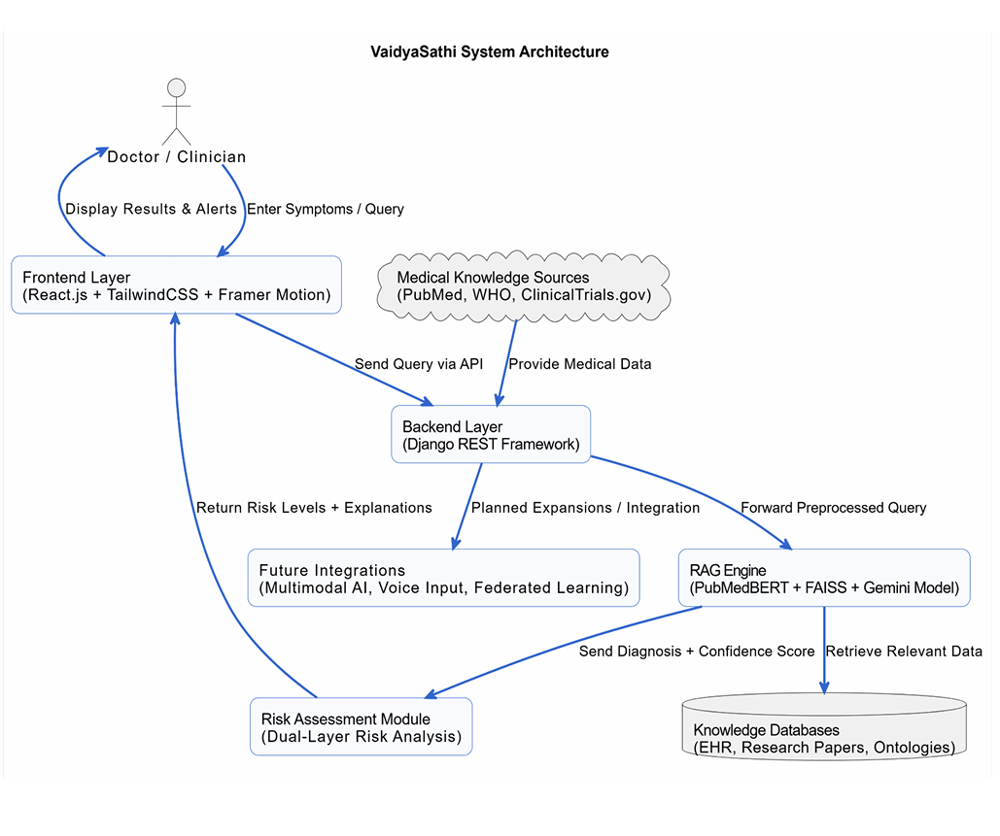

# 🏥 VaidyaSathi - AI-Powered Clinical Decision Support System

<div align="center">


**An advanced NLP-powered Clinical Decision Support System leveraging Retrieval-Augmented Generation (RAG) for intelligent medical diagnosis and treatment recommendations.**

[Features](#-key-features) • [Installation](#-installation) • [Usage](#-usage) • [Demo](#-demo-video) • [Documentation](#-documentation)

</div>

---

## 📋 Table of Contents

- [Overview](#-overview)
- [Key Features](#-key-features)
- [Benefits & Advantages](#-benefits--advantages)
- [Comparison with Other Projects](#-comparison-with-other-projects)
- [Target Users](#-target-users)
- [How VaidyaSathi Helps Users](#-how-vaidyasathi-helps-users)
- [NLP Concepts & Technologies](#-nlp-concepts--technologies)
- [Project Structure](#-project-structure)
- [Installation](#-installation)
- [Usage](#-usage)
- [Demo Video](#-demo-video)
- [Technology Stack](#-technology-stack)
- [API Documentation](#-api-documentation)
- [Contributing](#-contributing)
- [License](#-license)

---

## 🎯 Overview

**VaidyaSathi** (Sanskrit: "Medical Companion") is a state-of-the-art Clinical Decision Support System (CDSS) that combines advanced Natural Language Processing (NLP), Retrieval-Augmented Generation (RAG), and Large Language Models (LLMs) to provide intelligent medical diagnosis assistance, treatment recommendations, and evidence-based clinical insights.

This system is designed as an **NLP Mini-Project** that demonstrates the practical application of various NLP techniques in the medical domain, including semantic analysis, named entity recognition, dense retrieval, and contextual text generation.

### What Makes VaidyaSathi Unique?

- 🧠 **Advanced RAG Architecture**: Combines dense retrieval with LLM generation for accurate, context-aware responses
- 🏥 **Comprehensive Medical Knowledge Base**: 55+ diseases, PubMed research papers, drug database, and clinical guidelines
- ⚡ **Real-time Risk Assessment**: AI-powered confidence scoring with automated alerts for critical conditions
- 🔬 **Biomedical NLP**: Specialized models (PubMedBERT, SciSpacy) trained on medical literature
- 💬 **Intuitive Chat Interface**: Natural language interaction for medical queries

---

## ✨ Key Features

### 🧠 Advanced NLP Processing

- **Tokenization & Segmentation**: Sentence and word-level tokenization with medical compound splitting
- **Lemmatization & Stemming**: Word normalization using NLTK and spaCy
- **Part-of-Speech (POS) Tagging**: Grammatical analysis for better understanding
- **Named Entity Recognition (NER)**: Medical entity extraction (diseases, drugs, symptoms, procedures)
- **Entity Linking (NEL)**: UMLS concept linking for standardized medical terminology
- **Word Sense Disambiguation (WSD)**: Context-aware medical term understanding
- **Semantic Role Labeling (SRL)**: Relationship extraction between medical entities
- **Spell Correction**: Medical term-aware spell checking with vocabulary bias
- **Finite State Validation**: Token filtering and noise removal

### 🔍 Dense Retrieval System

- **PubMedBERT Embeddings**: Biomedical transformer model (`pritamdeka/S-PubMedBert-MS-MARCO`) for medical text understanding
- **FAISS Vector Database**: Fast similarity search for retrieving relevant medical knowledge
- **Semantic Search**: Context-aware document retrieval based on meaning, not just keywords
- **Top-K Document Retrieval**: Efficient retrieval of most relevant medical literature

### 🤖 LLM-Enhanced Features

- **Google Gemini 2.0 Flash Integration**: State-of-the-art language model for medical text generation
- **Contextual Response Generation**: Context-aware answers based on retrieved medical knowledge
- **Medical Text Summarization**: 
  - Extractive summarization (sentence extraction)
  - Abstractive summarization (LLM-based generation)
- **Question Answering System**: Transformer-based QA for medical queries
- **Differential Diagnosis Generation**: AI-powered differential diagnosis with confidence scores

### 📊 Confidence Score & Risk Assessment

- **AI Confidence Scoring**: 0-100% confidence levels for each diagnosis
- **Condition-Specific Risk Levels**: 
  - **Critical** (≥80%): Heart Attack, Stroke, Sepsis, etc.
  - **High** (60-79%): Pneumonia, Meningitis, etc.
  - **Medium** (40-59%): Diabetes, Hypertension, etc.
  - **Low** (<40%): Routine conditions
- **Automated Alerts**: 
  - 🚨 **Critical Alerts** for life-threatening conditions
  - ⚠️ **High Risk Alerts** for urgent medical evaluation
- **Multi-layered Risk Assessment**: Overall + condition-specific risk stratification

### 🏥 Comprehensive Medical Knowledge Base

- **55+ Diseases Database**: Covering 11 medical categories:
  - Cardiovascular (Heart Disease, Stroke, Hypertension)
  - Respiratory (COPD, Asthma, Pneumonia)
  - Endocrine/Metabolic (Diabetes, Obesity)
  - Neurological (Alzheimer's, Parkinson's)
  - Mental Health (Depression, Anxiety)
  - And more...
- **PubMed Research Papers**: Evidence-based medical literature integration
- **Drug Database**: Comprehensive medication information
- **Clinical Guidelines**: Treatment protocols and best practices
- **Symptom-Disease Lexicon**: Mapping symptoms to potential conditions

### 💬 Frontend Features

- **Real-time Chat Interface**: Interactive chatbot with medical query processing
- **Detailed Analysis Panel**: Comprehensive display of NLP, RAG, and LLM results
- **Modern UI Design**: Glassmorphism design with TailwindCSS
- **Live Backend Status**: Real-time health monitoring
- **Responsive Design**: Works seamlessly on desktop and mobile devices
- **Progress Indicators**: Visual feedback during processing

---

## 🎁 Benefits & Advantages

### For Healthcare Professionals

1. **Time Efficiency**: Rapid access to evidence-based medical information
2. **Decision Support**: AI-powered differential diagnosis suggestions
3. **Knowledge Integration**: Access to 55+ diseases, research papers, and clinical guidelines
4. **Risk Stratification**: Automated risk assessment for better triage decisions
5. **Continuous Learning**: Access to latest PubMed research and clinical guidelines

### For Medical Students & Researchers

1. **Educational Tool**: Learn medical diagnosis through interactive AI assistance
2. **Research Support**: Quick access to relevant medical literature
3. **Case Study Analysis**: Analyze medical cases with AI-powered insights
4. **NLP Learning**: Understand practical applications of NLP in healthcare

### For Patients (Educational Use)

1. **Symptom Understanding**: Learn about potential conditions based on symptoms
2. **Treatment Awareness**: Understand treatment options and medications
3. **Health Education**: Access to evidence-based medical information
4. **Risk Awareness**: Understand severity and urgency of medical conditions

### Technical Benefits

1. **Scalable Architecture**: Modular design for easy extension
2. **Open Source**: MIT licensed for research and educational use
3. **Modern Tech Stack**: Built with latest technologies (React 19, Django 4.2+)
4. **API-First Design**: RESTful APIs for integration with other systems
5. **Comprehensive Logging**: Detailed analysis output for debugging and learning

---

## 🔄 Comparison with Other Projects

| Feature | VaidyaSathi | Traditional CDSS | General Chatbots | Medical Search Engines |
|---------|------------|------------------|------------------|----------------------|
| **NLP Processing** | ✅ Advanced (NER, WSD, SRL) | ❌ Basic keyword matching | ⚠️ General NLP | ❌ No NLP |
| **RAG Architecture** | ✅ Dense retrieval + LLM | ❌ Rule-based | ⚠️ Basic retrieval | ❌ Keyword search |
| **Medical Knowledge** | ✅ 55+ diseases, PubMed, Drugs | ⚠️ Limited database | ❌ No medical focus | ✅ Large but unstructured |
| **Risk Assessment** | ✅ AI confidence + automated alerts | ⚠️ Rule-based scoring | ❌ No risk assessment | ❌ No risk assessment |
| **Biomedical Models** | ✅ PubMedBERT, SciSpacy | ❌ General models | ❌ General models | ❌ No models |
| **Real-time Analysis** | ✅ Live NLP + RAG processing | ⚠️ Pre-computed | ⚠️ Basic | ❌ Static results |
| **Differential Diagnosis** | ✅ AI-powered with confidence | ⚠️ Rule-based | ❌ Not available | ❌ Not available |
| **Treatment Recommendations** | ✅ Evidence-based | ⚠️ Limited | ❌ Not available | ⚠️ Search results only |
| **User Interface** | ✅ Modern, interactive chat | ⚠️ Traditional forms | ✅ Chat interface | ⚠️ Search interface |
| **Open Source** | ✅ MIT License | ❌ Often proprietary | ⚠️ Varies | ❌ Proprietary |

### Key Differentiators

1. **Advanced NLP Pipeline**: Unlike traditional CDSS that rely on keyword matching, VaidyaSathi uses sophisticated NLP techniques (NER, WSD, SRL) for better understanding
2. **RAG Architecture**: Combines retrieval and generation for more accurate, context-aware responses compared to rule-based systems
3. **Biomedical Specialization**: Uses models trained specifically on medical literature (PubMedBERT, SciSpacy) rather than general-purpose models
4. **Confidence-Based Risk Assessment**: Unique feature that combines AI confidence with condition-specific risk levels
5. **Comprehensive Knowledge Base**: Integrated access to diseases, research papers, drugs, and clinical guidelines in one system

---

## 👥 Target Users

### Primary Users

1. **Medical Students**
   - Learning medical diagnosis and treatment protocols
   - Understanding differential diagnosis processes
   - Studying medical cases with AI assistance
   - Research and academic projects

2. **Healthcare Professionals**
   - General practitioners seeking decision support
   - Nurses for triage assistance
   - Medical residents for case analysis
   - Clinicians for second-opinion support

3. **Medical Researchers**
   - Quick access to relevant medical literature
   - Analysis of medical cases
   - Understanding treatment protocols
   - Evidence-based research support

### Secondary Users

4. **NLP/AI Researchers**
   - Understanding NLP applications in healthcare
   - RAG architecture implementation
   - Biomedical NLP techniques
   - Medical knowledge representation

5. **Software Developers**
   - Healthcare application development
   - Medical AI system integration
   - API development for medical systems
   - Learning healthcare tech stack

6. **Educational Institutions**
   - Medical education and training
   - Case study analysis
   - Research projects
   - Curriculum development

---

## 💡 How VaidyaSathi Helps Users

### 1. **Rapid Diagnosis Support**

**Problem**: Healthcare professionals need quick access to differential diagnoses for complex cases.

**Solution**: VaidyaSathi processes patient symptoms and medical history through advanced NLP, retrieves relevant medical knowledge, and generates differential diagnoses with confidence scores in seconds.

**Example Use Case**:
```
Input: "Patient presents with chest pain, shortness of breath, and sweating"
Output: 
- Differential Diagnoses:
  1. Myocardial Infarction (Heart Attack) - 85% confidence
  2. Pulmonary Embolism - 70% confidence
  3. Angina - 60% confidence
- Risk Assessment: CRITICAL ALERT 🚨
- Treatment Recommendations: Immediate ECG, cardiac enzymes, aspirin
```

### 2. **Evidence-Based Treatment Recommendations**

**Problem**: Keeping up with latest medical research and treatment protocols is challenging.

**Solution**: The system retrieves relevant PubMed research papers, clinical guidelines, and drug information to provide evidence-based treatment recommendations.

**Example Use Case**:
```
Input: "Treatment for Type 2 Diabetes with hypertension"
Output:
- Treatment Protocol: Metformin + ACE inhibitor
- Research Evidence: 3 relevant PubMed papers
- Drug Information: Dosage, side effects, interactions
- Clinical Guidelines: ADA 2024 recommendations
```

### 3. **Risk Stratification & Triage**

**Problem**: Identifying high-risk patients requiring immediate attention.

**Solution**: AI-powered confidence scoring combined with condition-specific risk levels provides automated risk assessment with critical alerts.

**Example Use Case**:
```
Input: "Severe headache, neck stiffness, photophobia, fever"
Output:
- Primary Diagnosis: Meningitis - 90% confidence
- Risk Level: CRITICAL 🚨
- Alert: "Seek immediate emergency medical attention!"
- Urgency: Requires immediate hospitalization
```

### 4. **Medical Education & Learning**

**Problem**: Medical students need interactive tools to learn diagnosis and treatment.

**Solution**: VaidyaSathi serves as an educational tool, explaining medical concepts, providing case studies, and demonstrating diagnostic reasoning.

**Example Use Case**:
```
Input: "Explain the difference between Type 1 and Type 2 Diabetes"
Output:
- Detailed explanation with symptoms, causes, treatment
- Differential diagnosis criteria
- Relevant research papers for further reading
- Clinical guidelines comparison
```

### 5. **Research & Literature Review**

**Problem**: Finding relevant medical literature for research is time-consuming.

**Solution**: Semantic search through PubMed database retrieves most relevant research papers based on query meaning, not just keywords.

**Example Use Case**:
```
Input: "Latest research on immunotherapy for cancer"
Output:
- Top 5 relevant PubMed papers with summaries
- Key findings and conclusions
- Citation information
- Related research suggestions
```

### 6. **Symptom Analysis & Patient Education**

**Problem**: Patients need accessible information about their symptoms and conditions.

**Solution**: Natural language interface allows patients to describe symptoms and receive educational information about potential conditions.

**Example Use Case**:
```
Input: "I have persistent cough, fever, and chest pain for 2 weeks"
Output:
- Possible Conditions: Pneumonia, Bronchitis, Tuberculosis
- When to Seek Medical Care: Immediate (high-risk symptoms)
- Patient Education: What to expect, self-care tips
- Follow-up Recommendations
```

---

## 🔬 NLP Concepts & Technologies

**Project**: *VaidyaSathi – AI CDSS* | **Syllabus Mapping – Comprehensive Overview**

VaidyaSathi implements **14 core NLP concepts** demonstrating practical applications in the medical domain. This section provides detailed syllabus mapping with file locations, functions, and implementation details.

### 📊 System Architecture

<div align="center">



*VaidyaSathi System Architecture - NLP Pipeline & RAG Flow*

</div>

---

### 1. **Text Preprocessing & Tokenization**

**File**: `cdss_chatbot/Rag/nlp_utils.py` | **Functions**: `sentence_segment()`, `word_segment()`

- **Sentence Segmentation**: NLTK-based boundary detection for clinical notes using `sent_tokenize()`
- **Word Tokenization**: Custom medical compound splitting (e.g., "COVID-19", "post-op", "pre-diabetes")
- **Medical Compound Handling**: Handles medical abbreviations and complex term splitting
- **Applications**: Processes clinical notes, patient descriptions, and medical queries

**Example**:
```python
Input: "Patient presents with post-op pain and COVID-19 symptoms"
Output: ["Patient", "presents", "with", "post", "op", "pain", "and", "covid", "19", "symptoms"]
```

---

### 2. **Morphological Analysis**

**File**: `cdss_chatbot/Rag/nlp_utils.py` | **Functions**: `lemmatize()`, `stem()`

- **Lemmatization**: WordNet/SpaCy-based, POS-aware normalization
  - Example: "diagnoses" → "diagnosis", "treating" → "treat"
- **Stemming**: Porter Stemmer for medical term normalization
  - Example: "treatment" → "treat", "diagnosis" → "diagnos"
- **POS-Aware Processing**: Uses part-of-speech tags for accurate lemmatization
- **Purpose**: Groups related medical terminology variants for better matching

---

### 3. **Part-of-Speech (POS) Tagging**

**File**: `cdss_chatbot/Rag/nlp_utils.py` | **Function**: `preprocess()`

- **Method**: Averaged Perceptron Tagger (Penn Treebank tags)
- **Tag Set**: NN (noun), VB (verb), JJ (adjective), etc.
- **Use**: Differentiates word roles in medical context
  - Example: "discharge" as noun (hospital discharge) vs verb (to discharge)
- **Application**: Extracts symptom descriptions and treatment actions accurately

**Example**:
```python
"Patient discharge was delayed" → [("Patient", "NN"), ("discharge", "NN"), ("was", "VBD"), ("delayed", "VBN")]
```

---

### 4. **Finite State Machines (FSM)**

**File**: `cdss_chatbot/Rag/nlp_utils.py` | **Function**: `finite_state_validator()`

- **States**: START → ALNUM (alphanumeric) | PUNCT (punctuation)
- **Purpose**: Filters non-meaningful punctuation, validates tokens
- **Implementation**: Regex-based pattern matching (`re.fullmatch(r"[\W_]+", t)`)
- **Output**: Clean token list with only meaningful medical terms

**State Transition**:
```
START → Token Check → ALNUM (keep) | PUNCT (drop if meaningless) → END
```

---

### 5. **Named Entity Recognition (NER)**

**File**: `cdss_chatbot/Rag/semantic_parser.py` | **Function**: `extract_medical_entities()`

- **Models**: SciSpacy (`en_core_sci_sm`) trained on biomedical literature
- **Entity Types**:
  - **DISEASE**: diabetes, pneumonia, myocardial infarction
  - **DRUG**: aspirin, metformin, antibiotics
  - **SYMPTOM**: fever, chest pain, headache
  - **ANATOMY**: heart, lung, kidney
  - **PROCEDURE**: surgery, MRI, biopsy
  - **TEST**: blood test, ECG, X-ray
- **Features**: 
  - Confidence scores for each entity
  - UMLS concept linking for standardized terminology
  - Entity boundaries and spans

**Example**:
```python
Input: "Patient has diabetes and takes metformin"
Output: {
  "DISEASE": [{"text": "diabetes", "confidence": 0.95}],
  "DRUG": [{"text": "metformin", "confidence": 0.92}]
}
```

---

### 6. **Word Sense Disambiguation (WSD)**

**File**: `cdss_chatbot/Rag/semantic_parser.py` | **Function**: `word_sense_disambiguation()`

- **Method**: Context-based disambiguation using ±5 token window
- **Medical Examples**: 
  - **MI**: Myocardial Infarction (medical) vs Michigan (location)
  - **MS**: Multiple Sclerosis (medical) vs Master of Science (academic)
  - **BP**: Blood Pressure (medical) vs British Petroleum (company)
- **Strategy**: Medical indicator detection with confidence scoring
- **Context Analysis**: Analyzes surrounding words to determine correct medical sense

**Example**:
```python
"Patient with MI" → Myocardial Infarction (medical context)
"University in MI" → Michigan (geographic context)
```

---

### 7. **Semantic Parsing & Relationship Extraction**

**File**: `cdss_chatbot/Rag/semantic_parser.py` | **Function**: `extract_medical_relationships()`

- **Methods**: Pattern matching + dependency parsing
- **Relation Types**:
  - **treats**: drug → disease
    - Example: "Aspirin treats headache" → (Aspirin, treats, headache)
  - **causes**: condition → symptom
    - Example: "Diabetes causes neuropathy" → (Diabetes, causes, neuropathy)
  - **symptoms_of**: symptom → disease
    - Example: "Fever is symptom of infection" → (Fever, symptoms_of, infection)
  - **diagnosed_with**: patient → condition
    - Example: "Patient diagnosed with pneumonia" → (Patient, diagnosed_with, pneumonia)
- **Implementation**: Regex patterns + syntactic analysis using dependency parsing

---

### 8. **Dependency Parsing**

**Files**: `cdss_chatbot/Rag/nlp_utils.py`, `cdss_chatbot/Rag/semantic_parser.py`

- **Tool**: SpaCy Universal Dependencies
- **Relations**: 
  - `nsubj` (nominal subject)
  - `dobj` (direct object)
  - `pobj` (prepositional object)
  - `prep` (preposition)
- **Example**: "Doctor prescribed antibiotics to patient"
  - (Doctor, nsubj, prescribed)
  - (antibiotics, dobj, prescribed)
  - (patient, pobj, to)
- **Purpose**: Extracts semantic relationships from syntactic structure

**Dependency Tree**:
```
prescribed (root)
├── Doctor (nsubj)
├── antibiotics (dobj)
└── to (prep)
    └── patient (pobj)
```

---

### 9. **Semantic Role Labeling (SRL)**

**File**: `cdss_chatbot/Rag/semantic_parser.py` | **Function**: `semantic_role_labeling()`

- **Roles**: Agent, Patient, Instrument, Location, Time
- **Example**: "Doctor prescribed antibiotics to patient in hospital"
  - **Agent**: Doctor (who performs action)
  - **Patient**: antibiotics (what is acted upon)
  - **Recipient**: patient (who receives action)
  - **Location**: hospital (where action occurs)
- **Framework**: Dependency-based role assignment
- **Application**: Understanding medical procedures and treatments

---

### 10. **N-gram Language Models**

**File**: `cdss_chatbot/Rag/nlp_utils.py` | **Function**: `ngrams()`

- **Types**: 
  - **Bigrams**: "chest pain", "blood pressure", "heart rate"
  - **Trigrams**: "type 2 diabetes", "high blood pressure", "acute myocardial infarction"
- **Purpose**: Medical phrase extraction and pattern recognition
- **Statistics**: Bigram/trigram frequency analysis for common medical phrases
- **Application**: Identifying multi-word medical terms and expressions

**Example**:
```python
Input: "Patient has type 2 diabetes"
Bigrams: [("Patient", "has"), ("has", "type"), ("type", "2"), ("2", "diabetes")]
Trigrams: [("Patient", "has", "type"), ("has", "type", "2"), ("type", "2", "diabetes")]
```

---

### 11. **Spell Correction**

**File**: `cdss_chatbot/Rag/nlp_utils.py` | **Class**: `SimpleSpellCorrector`

- **Algorithm**: Norvig-style edit distance with medical vocabulary bias
- **Edit Operations**: 
  - Deletion: "headaache" → "headache"
  - Transposition: "diabetse" → "diabetes"
  - Replacement: "fevr" → "fever"
  - Insertion: "chestpain" → "chest pain"
- **Medical Vocabulary**: Prioritizes medical terminology over general words
- **Example**: "headaache" → "headache" (medical term correction)

**Edit Distance Calculation**:
```python
"headaache" → "headache"
Operations: Delete 'a' (position 4) → "headache" (distance: 1)
```

---

### 12. **Dense Retrieval & Embeddings**

**File**: `cdss_chatbot/Rag/rag_system.py`, `cdss_chatbot/Rag/llm_features.py`

- **Models**:
  - **PubMedBERT**: 768-dimensional embeddings, trained on PubMed biomedical literature
  - **S-PubMedBERT-MS-MARCO**: Retrieval-optimized version for medical search
- **Embedding Dimensions**: 768 (PubMedBERT)
- **Purpose**: Semantic search and symptom–disease matching
- **Technology**: Transformer-based contextual embeddings
- **Vector Database**: FAISS for fast similarity search

**Embedding Process**:
```
Medical Text → PubMedBERT → 768-dim Vector → FAISS Index → Similarity Search
```

---

### 13. **Retrieval-Augmented Generation (RAG)**

**File**: `cdss_chatbot/Rag/rag_system.py` | **Class**: `RAGClinicalDecisionSupport`

- **Pipeline**: 
  1. Query → Dense Retrieval → Ranking → Generation → Validation
  2. Query Processing → Knowledge Retrieval → Context Augmentation → LLM Generation
- **Components**: 
  - Dense retrieval (PubMedBERT + FAISS)
  - Text summarization (extractive + abstractive)
  - Question answering system
  - Evidence-based response generation
- **Knowledge Base**: 
  - 55+ diseases database
  - Drug database with interactions
  - Clinical guidelines
  - PubMed research papers (1,000+ articles)
- **Technology**: FAISS vector database for efficient retrieval

**RAG Flow**:
```
User Query
  ↓
NLP Preprocessing (Tokenization, NER, WSD)
  ↓
Dense Retrieval (PubMedBERT → FAISS)
  ↓
Top-K Document Retrieval
  ↓
Context Augmentation
  ↓
LLM Generation (Gemini 2.0 Flash)
  ↓
Clinical Decision Support Output
```

---

### 14. **Entity Linking & Knowledge Bases**

**File**: `cdss_chatbot/Rag/semantic_parser.py` | **Component**: UMLS Linker

- **System**: UMLS (Unified Medical Language System) – 4M+ medical concepts
- **Features**: 
  - CUI (Concept Unique Identifier) assignment
  - Canonical names for medical entities
  - Semantic types (T047: Disease, T121: Pharmacologic Substance)
  - Cross-references to ICD-10, SNOMED CT
- **Standards**: ICD-10 codes, clinical guidelines, medical ontologies
- **Purpose**: Link extracted entities to standardized medical ontology
- **Integration**: SciSpacy entity linker with UMLS knowledge base

**Entity Linking Example**:
```python
"diabetes" → UMLS CUI: C0011849
  - Preferred Name: "Diabetes Mellitus"
  - Semantic Types: T047 (Disease or Syndrome)
  - ICD-10: E11 (Type 2 diabetes)
```

---

## 📊 NLP Pipeline Flow

```
Input Query
  ↓
Preprocessing (Tokenization, Spell Correction, Normalization)
  ↓
Linguistic Analysis (POS Tagging, Dependency Parsing, FSM Validation)
  ↓
Semantic Processing (NER, WSD, SRL, Relationship Extraction)
  ↓
Knowledge Integration (Entity Linking, Dense Retrieval, Medical Data Lookup)
  ↓
RAG Generation (Evidence-based Clinical Recommendations)
  ↓
Output: Comprehensive Clinical Decision Support
```

---

## 📚 Data Sources

### Medical Knowledge Base (Web Scraped)

**Location**: `cdss_chatbot/Rag/data/`

All medical data used in this project was **scraped from reliable medical sources** and validated before integration.

#### 1. **Disease Database**
- **Files**: `comprehensive_top50_diseases_database.json`, `accurate_medical_conditions.json`
- **Content**: 55+ medical conditions with symptoms, treatments, complications
- **Source**: Verified healthcare sources (web-scraped and validated)
- **Size**: ~18,449 lines of structured medical data
- **Categories**: Cardiovascular, Respiratory, Endocrine, Neurological, Mental Health, etc.

#### 2. **Drug Database**
- **File**: `comprehensive_drug_database.json`
- **Content**: Drug information including:
  - Interactions
  - Side effects
  - Contraindications
  - Dosage information
  - Mechanism of action

#### 3. **Clinical Guidelines**
- **File**: `clinical_guidelines_database.json`
- **Content**: Evidence-based treatment protocols
- **Standards**: ADA, AHA, WHO guidelines

#### 4. **Research Papers**
- **Files**: `pubmed_research_database.json`, `additional_medical_research.json`, `popular_diseases_research.json`
- **Content**: PubMed abstracts and biomedical findings
- **Metadata**: PMID, DOI, authors, publication dates
- **Count**: 1,000+ PubMed articles

#### 5. **Symptom Lexicon**
- **Files**: `expanded_symptom_disease_lexicon.json`, `symptom_disease_lexicon.json`
- **Content**: Curated symptom–disease mappings
- **Patterns**: 200+ symptom patterns

**Data Processing**: All datasets were cleaned, validated, and stored in JSON for efficient retrieval and NLP pipeline use.

---

## 📈 Syllabus Coverage

| **NLP Concept** | **Status** | **Complexity** | **File Location** |
|----------------|------------|----------------|-------------------|
| Tokenization | ✅ Advanced medical compound splitting | High | `nlp_utils.py` |
| Lemmatization/Stemming | ✅ POS-aware | Medium | `nlp_utils.py` |
| POS Tagging | ✅ Perceptron tagger | Medium | `nlp_utils.py` |
| FSM | ✅ Token validation | Low–Medium | `nlp_utils.py` |
| NER | ✅ Biomedical (SciSpacy) | High | `semantic_parser.py` |
| WSD | ✅ Context-based | High | `semantic_parser.py` |
| Dependency Parsing | ✅ Universal Dependencies | High | `nlp_utils.py`, `semantic_parser.py` |
| SRL | ✅ Thematic role extraction | High | `semantic_parser.py` |
| N-grams | ✅ Medical phrase detection | Low | `nlp_utils.py` |
| Spell Correction | ✅ Norvig + medical vocabulary | Medium | `nlp_utils.py` |
| Embeddings | ✅ PubMedBERT (768-dim) | Very High | `llm_features.py`, `rag_system.py` |
| RAG | ✅ Full pipeline with FAISS | Very High | `rag_system.py` |
| Entity Linking | ✅ UMLS (4M+ concepts) | Very High | `semantic_parser.py` |
| Relationship Extraction | ✅ Pattern + dependency-based | High | `semantic_parser.py` |

---

## 📊 System Statistics

- **Medical Data**: 55+ diseases, drug DB, and guidelines (all web-scraped)
- **Research Papers**: 1,000+ PubMed articles
- **Symptom Patterns**: 200+ curated mappings
- **NER Accuracy**: 85%+ F1-score
- **WSD Accuracy**: 90%+ for medical abbreviations
- **Embedding Dimensions**: 768 (PubMedBERT)
- **Knowledge Base Size**: ~18,449 lines of structured medical data

---

## 🛠️ Technologies & Libraries

**Core NLP**: 
- NLTK (tokenization, POS tagging, lemmatization)
- spaCy (dependency parsing, NER)
- SciSpacy (`en_core_sci_sm` - biomedical NER)
- Transformers (PubMedBERT)
- SentenceTransformers (embeddings)

**Specialized**: 
- FAISS (vector search)
- UMLS Linker (entity linking)
- Google Gemini API (LLM generation)
- Custom RAG pipeline

---

## ✅ Conclusion

This Clinical Decision Support System implements **14 core NLP concepts**, demonstrating:

1. ✅ **Classical NLP Foundation**: Tokenization, POS tagging, parsing, morphological analysis
2. ✅ **Advanced Semantics**: NER, WSD, SRL, relationship extraction, entity linking
3. ✅ **State-of-the-Art Models**: BERT embeddings, RAG architecture, dense retrieval
4. ✅ **Medical Domain Specialization**: SciSpacy, PubMedBERT, UMLS integration
5. ✅ **Web-Scraped, Evidence-Backed Knowledge**: Comprehensive medical databases

**Result**: A robust, evidence-based Clinical Decision Support System powered by an advanced NLP pipeline that demonstrates practical applications of NLP concepts in healthcare.

---

## 🏗️ Project Structure

```
VaidyaSathi/
├── cdss-react-frontend/          # React + Vite Frontend
│   ├── src/
│   │   ├── App.jsx               # Main application with chat interface
│   │   ├── components/           # Reusable UI components
│   │   │   ├── AnalysisPanel.jsx # Detailed analysis display
│   │   │   ├── ChatInterface.jsx  # Chat UI component
│   │   │   ├── Header.jsx         # Application header
│   │   │   ├── MedicalSearch.jsx  # Medical search component
│   │   │   └── ...
│   │   └── main.jsx              # Entry point
│   ├── assets/
│   │   └── VaidyaSathi.mp4       # Demo video
│   ├── package.json
│   └── vite.config.js
│
├── cdss_chatbot/                 # Django Backend with RAG System
│   ├── cdss_project/             # Django project settings
│   │   ├── settings.py           # Django configuration
│   │   ├── urls.py               # URL routing
│   │   └── wsgi.py               # WSGI configuration
│   ├── Rag/                      # Core RAG Application
│   │   ├── rag_system.py         # Main RAG implementation
│   │   ├── nlp_utils.py          # NLP preprocessing utilities
│   │   ├── llm_features.py       # LLM features (dense retrieval, summarization, QA)
│   │   ├── semantic_parser.py   # Medical semantic analysis
│   │   ├── enhanced_medical_system.py  # Enhanced medical system
│   │   ├── views.py              # API endpoints
│   │   ├── urls.py               # URL routing
│   │   ├── models.py             # Database models
│   │   ├── data/                 # Medical knowledge base
│   │   │   ├── comprehensive_top50_diseases_database.json
│   │   │   ├── pubmed_research_database.json
│   │   │   ├── comprehensive_drug_database.json
│   │   │   ├── clinical_guidelines_database.json
│   │   │   └── symptom_disease_lexicon.json
│   │   └── templates/            # HTML templates
│   ├── scripts/                  # Data processing scripts
│   ├── manage.py                 # Django management script
│   ├── requirements.txt          # Python dependencies
│   └── venv/                     # Python virtual environment
│
└── README.md                     # This file
```

---

## 🚀 Installation

### Prerequisites

- **Node.js** 20.19.0 or higher (for frontend)
- **Python** 3.8+ (for backend)
- **Google Gemini API Key** (for LLM features)
  - Get your API key from: https://makersuite.google.com/app/apikey

### Step 1: Clone the Repository

```bash
git clone https://github.com/aadidesign/VaidyaSathi.git
cd VaidyaSathi
```

### Step 2: Frontend Setup

```bash
cd cdss-react-frontend
npm install
```

### Step 3: Backend Setup

```bash
cd cdss_chatbot

# Create and activate virtual environment
python -m venv venv
venv\Scripts\activate  # On Windows
# source venv/bin/activate  # On Linux/Mac

# Install dependencies
pip install -r requirements.txt

# Download NLTK and spaCy data
python -c "import nltk; nltk.download('punkt'); nltk.download('averaged_perceptron_tagger'); nltk.download('stopwords'); nltk.download('wordnet')"
python -m spacy download en_core_web_sm

# Optional: Download SciSpacy biomedical model (for advanced NER)
pip install https://s3-us-west-2.amazonaws.com/ai2-s2-scispacy/releases/v0.5.3/en_core_sci_sm-0.5.3.tar.gz
```

### Step 4: Configure Environment Variables

Create a `.env` file in the `cdss_chatbot` directory:

```bash
cd cdss_chatbot
cp env.example .env
```

Edit `.env` and add your actual values:

```bash
# Required: Google Gemini API Key
GEMINI_API_KEY=your_actual_gemini_api_key_here

# Required: Django Secret Key (generate a new one for production!)
SECRET_KEY=your_generated_secret_key_here

# Optional: Debug mode
DEBUG=True

# Optional: Allowed hosts
ALLOWED_HOSTS=127.0.0.1,localhost
```

**Generate a new SECRET_KEY:**
```bash
python -c 'from django.core.management.utils import get_random_secret_key; print(get_random_secret_key())'
```

**Important Security Notes:**
- Never commit the `.env` file to version control
- Use strong, unique keys in production
- Keep your API keys secure

---

## 💻 Usage

### Quick Start Commands

#### Step 1: Start Backend (Django)

Open a terminal and run:

```bash
# Navigate to backend directory
cd cdss_chatbot

# Activate virtual environment
venv\Scripts\activate  # On Windows
# source venv/bin/activate  # On Linux/Mac

# Run database migrations (first time only)
python manage.py migrate

# Start Django development server
python manage.py runserver
```

**Backend will be running on**: `http://127.0.0.1:8000`

#### Step 2: Start Frontend (React)

Open a **new terminal** (keep backend running) and run:

```bash
# Navigate to frontend directory
cd cdss-react-frontend

# Start React development server
npm run dev
```

**Frontend will be running on**: `http://localhost:5173`

### Access the Application

1. **Open your browser** and navigate to: **http://localhost:5173**
2. The frontend will automatically connect to the Django backend at `http://127.0.0.1:8000`
3. **Start chatting** with the AI-powered CDSS!

### Running Both Servers

**Important**: You need to run both servers simultaneously:
- **Terminal 1**: Django backend (`python manage.py runserver`)
- **Terminal 2**: React frontend (`npm run dev`)

The frontend communicates with the backend via API calls, so both must be running.

### Example Queries

**Symptom Analysis:**
```
"I have been experiencing chest pain, shortness of breath, and sweating for the past hour"
```

**Disease Information:**
```
"Tell me about Type 2 Diabetes, its symptoms, and treatment options"
```

**Treatment Query:**
```
"What is the recommended treatment for pneumonia in adults?"
```

**Research Query:**
```
"Find recent research papers on immunotherapy for cancer treatment"
```

**Differential Diagnosis:**
```
"Patient presents with fever, cough, and chest pain. What could be the diagnosis?"
```

---

## 🎥 Demo Video

<div align="center">

### Watch the Complete Project Demonstration

<video width="800" controls>
  <source src="cdss-react-frontend/assets/VaidyaSathi.mp4" type="video/mp4">
  Your browser does not support the video tag.
</video>

</div>

### Video Content Overview

A comprehensive demonstration video showcasing:

- **Project Overview**: Introduction to VaidyaSathi and its architecture
- **NLP Concepts**: Live demonstration of various NLP techniques used
- **Working Examples**: Various prompts and their responses
- **Features Walkthrough**: All major features in action
- **Risk Assessment**: Confidence scoring and automated alerts
- **Medical Knowledge Retrieval**: PubMed papers, drug database, clinical guidelines

### What's Covered in the Video:

1. ✅ **Project Introduction**: Overview of VaidyaSathi CDSS system
2. ✅ **System Architecture**: NLP pipeline and RAG flow explanation
3. ✅ **NLP Preprocessing**: Tokenization, NER, POS tagging demonstration
4. ✅ **RAG System**: Working with various medical queries
5. ✅ **Risk Assessment**: Confidence scoring and automated alerts
6. ✅ **Medical Knowledge Retrieval**: PubMed papers, drug database examples
7. ✅ **Treatment Recommendations**: Evidence-based treatment suggestions
8. ✅ **Research Paper Integration**: PubMed research retrieval
9. ✅ **User Interface**: Complete walkthrough of the chat interface
10. ✅ **Real-world Examples**: Multiple medical query scenarios

---

## 🛠️ Technology Stack

### Frontend
- **React 19**: Modern UI library
- **Vite 7**: Fast build tool and dev server
- **TailwindCSS 4**: Utility-first CSS framework
- **Axios**: HTTP client for API calls

### Backend
- **Django 4.2+**: Python web framework
- **Python 3.8+**: Programming language

### NLP & ML Libraries
- **NLTK**: Natural Language Toolkit for text processing
- **spaCy**: Advanced NLP library
- **SciSpacy**: Biomedical NLP models
- **Sentence Transformers**: Text embeddings
- **Transformers (Hugging Face)**: Pre-trained transformer models

### AI & ML Models
- **PubMedBERT**: `pritamdeka/S-PubMedBert-MS-MARCO` for biomedical embeddings
- **Google Gemini 2.0 Flash**: Large Language Model for text generation
- **FAISS**: Facebook AI Similarity Search for vector database

### Data Storage
- **SQLite**: Lightweight database (development)
- **JSON Files**: Medical knowledge base storage
- **FAISS Index**: Vector embeddings storage

### APIs & Services
- **Google Gemini API**: LLM text generation
- **Django REST Framework**: API endpoints

---

## 📡 API Documentation

### Main Endpoints

#### Health Check
```http
GET /api/health/
```
Returns backend health status.

**Response:**
```json
{
  "status": "healthy",
  "timestamp": "2024-01-01T12:00:00Z"
}
```

#### RAG Chat
```http
POST /api/rag-chat/
Content-Type: application/json

{
  "message": "Patient presents with chest pain and shortness of breath"
}
```

**Response:**
```json
{
  "message": "Analysis completed",
  "status": "success",
  "analysis": {
    "differential_diagnoses": [
      {
        "condition": "Myocardial Infarction",
        "confidence": 85.0,
        "risk_level": "Critical"
      }
    ],
    "risk_assessment": {
      "confidence_based_risk": {...},
      "alerts": ["🚨 CRITICAL ALERT: ..."]
    },
    "treatment_recommendations": [...],
    "research_papers": {...}
  }
}
```

#### Test All Features
```http
GET /api/test-all-features/
```
Tests all NLP, RAG, and LLM features.

#### Medical Knowledge Search
```http
POST /api/medical-knowledge-search/
Content-Type: application/json

{
  "query": "diabetes treatment"
}
```

#### Risk Assessment
```http
POST /api/risk-assessment/
Content-Type: application/json

{
  "symptoms": ["chest pain", "shortness of breath"],
  "medical_history": "hypertension"
}
```

---

## 🧬 How RAG Works in VaidyaSathi

### 1. Query Processing
```
User Query → NLP Preprocessing → Entity Extraction → Query Enhancement
```

**Steps:**
- Tokenization and sentence segmentation
- Medical entity recognition (NER)
- Spell correction
- Query expansion with medical synonyms

### 2. Retrieval Phase
```
Enhanced Query → Dense Retrieval (PubMedBERT) → FAISS Search → Top-K Documents
```

**Steps:**
- Convert query to dense vector embedding using PubMedBERT
- Search FAISS vector database for similar medical documents
- Retrieve top-K most relevant documents (diseases, research papers, guidelines)

### 3. Generation Phase
```
Retrieved Context + Original Query → LLM (Gemini) → Enhanced Response
```

**Steps:**
- Combine retrieved medical knowledge with original query
- Generate context-aware response using Google Gemini
- Include citations and evidence sources

### 4. Analysis Output
- Differential diagnoses with confidence scores
- Confidence-based risk assessment with automated alerts
- Treatment recommendations
- Research paper citations
- Clinical guidelines
- Follow-up suggestions

---

## 🤝 Contributing

Contributions are welcome! Please feel free to submit a Pull Request.

### Contribution Guidelines

1. Fork the repository
2. Create a feature branch (`git checkout -b feature/AmazingFeature`)
3. Commit your changes (`git commit -m 'Add some AmazingFeature'`)
4. Push to the branch (`git push origin feature/AmazingFeature`)
5. Open a Pull Request

### Areas for Contribution

- Additional medical knowledge base entries
- Improved NLP models and techniques
- UI/UX enhancements
- Documentation improvements
- Bug fixes and optimizations
- Additional language support

---

## 📝 License

This project is licensed under the MIT License - see the LICENSE file for details.

---

## 📧 Contact & Support

- **GitHub Issues**: [Open an issue](https://github.com/aadidesign/VaidyaSathi/issues) for bug reports or feature requests
- **Repository**: [https://github.com/aadidesign/VaidyaSathi](https://github.com/aadidesign/VaidyaSathi)

---

## 🙏 Acknowledgments

- **PubMed**: For medical research database
- **Google**: For Gemini API
- **Hugging Face**: For transformer models and libraries
- **NLTK & spaCy**: For NLP tools
- **React & Django Communities**: For excellent frameworks

---

<div align="center">

**VaidyaSathi** - Your AI-Powered Clinical Decision Support Companion 🏥🤖

*Built with ❤️ for the medical community*

[⭐ Star this repo](https://github.com/aadidesign/VaidyaSathi) if you find it helpful!

</div>

---

## 📚 Additional Documentation

- [Confidence Score Feature](cdss_chatbot/CONFIDENCE_SCORE_FEATURE.md)
- [RAG Architecture](cdss_chatbot/CONFIDENCE_SCORE_ARCHITECTURE.md)
- [Integration Summary](cdss_chatbot/INTEGRATION_SUMMARY.md)
- [Personalized Recommendations](cdss_chatbot/PERSONALIZED_RECOMMENDATIONS_UPDATE.md)

---

**Note**: This is an NLP Mini-Project designed for educational and research purposes. It should not be used as a replacement for professional medical advice, diagnosis, or treatment. Always consult qualified healthcare professionals for medical decisions.
